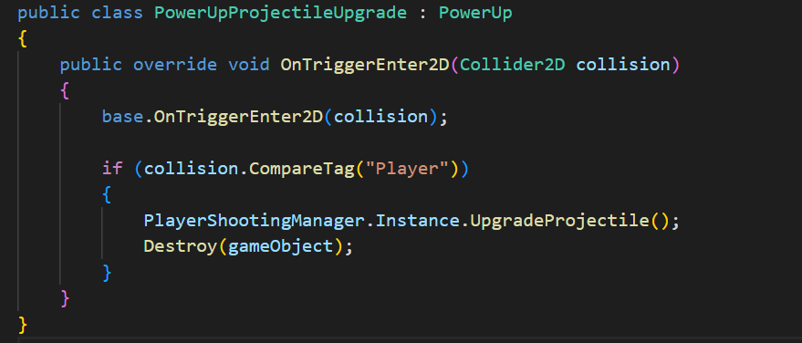
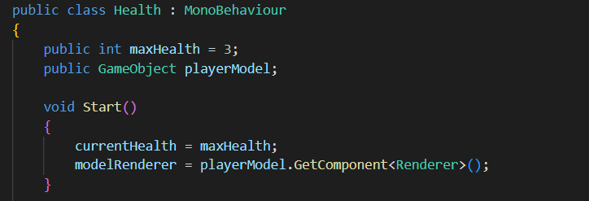
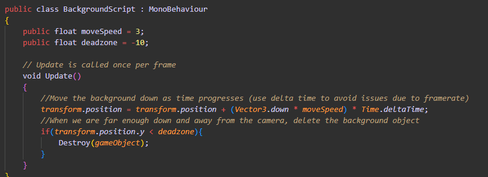

# CODENAME: SUPERNOVA
Stakeholders:  
* Thavindu Wijesena
* John McGuff
* Long Nguyen
* Kha Le
## Overview
Concept: A hybrid 2d galaga clone and an autorunner in the same vein as some mobile games like Subway Surfers on the windows platform.
Story: TBD
Setting: TBD
Structure: The game takes place on a 2D plane with players avoiding enemies and moving forward for as long as they can until something destroys them. The game continues to spawn more and different kinds of enemies until the game ends with the player's death. As the game continues, the player gains score based on time survived and enemies destroyed. The goal of the game is to simply get as high of a score as you can before you inevitably lose.

* 1.0 Basic Menus
* UI Design: John McGuff

    * 1.1: When the game is opened, the player is shown a Start Menu
        * In Unity, this is our Initial Scene in the build.
        * 1.11: The initial scene has user interface options that let the player start the game, quit out, view options, and view credits.
            * This can be provided for using unity Button.TMP objects. Font can be provided for via free Unity asset Thaleah Fat Font
            
            
    * 1.2: When the player hits the Escape button, a menu opens, and the game pauses.
       * 
        * This is accomplished by using a disabled canvas object in unity that is re-enabled when the player hits the Escape key,
        
        * ...and in the same function that re-enables the menu, we can set the timescale of the game to 0 'pause' the game. The buttons in this menu are more Unity Button.TMP objects with respective functions embedded in. 
        * 
        * 
        * When the player is ready to continue, the timescale is reset to 1 and the menu is disabled again. If the player elects to quit to the initial scene instead, we can additionally load the initial scene.
        
        
    * 1.3: The player can view High Scores in the initial scene
        * This is accomplished by loading a scene with a UI Canvas that populates with the names and scores of the High Scorers. 
        
        
        * We keep track the scores by saving/loading from a .json file, letting users save their
        accomplishments even when the game has exited.
        * 1.31: When the game ends by the player's destruction, the player will be prompted to add their name to the high score list
            * This is accomplished with another hidden UI object that has a textfield that can be read in as the name that goes along the player's score, which can be potentially added to the .json.
            * 
            * 
            * We then load the scoreboard scene, where the player gets to see if they've gained a new high score!
            

* 2.0 Player Functionality
* Player Design: Thavindu Wijesena
  * 2.1: A controllable player character
    * `Move()` function from `PlayerController.cs` deals with managing player control mechanics. It does the following steps:
       1. Retrieves the normalized horizontal input vector from the gameInput object
       2. Creates a movement direction vector in 3D space, considering only horizontal movement
       3. Determines the minimum and maximum x positions based on the screen edges, considering the player's width and an offset
       4. Calculates a new position for the player based on the current position, input, move speed, and delta time, ensuring it stays within the screen boundaries
       5.  Updates the player's position to the calculated new position
       

  * 2.2: Moves left and right with keyboard controls
    * In `@PlayerInputActions()` of `PlayerInputActions.cs`, `<Keyboard>` Left and Right refer to the specific keys on the keyboard that are mapped to the player's left and right movement, respectively. Input from these keys triggers the player object to go left or right using left or right arrow keys
      
      

  * 2.3: Player character fires a projectile
    * `Projectile` Class of `Projectile.cs` makes the projectile move vertically upwards at a constant speed defined by `moveSpeed`. It implements a projectile that falls or moves upward in the game world.
      
      
      * 2.31: Projectile is fired upon pressing a key
        * In `@PlayerInputActions()` of `PlayerInputActions.cs`, "shoot" is the action that fires a projectile. This action has a binding (Unnamed: """") which makes the action "shoot" trigger by pressing the spacebar on the `<Keyboard>`
        

  * 2.4: Powerups that alter fired projectile/player stats
    * `PowerUp` class of `PowerUp.cs` has the framework for power-ups in the game. Powerups spawn and move downward in the game. `moveSpeed` determines that speed. `pickupAudioClip` will be played when the powerups are picked up by the player. `OnTriggerEnter2D(Collider2D collision)` is the powerup collision detection when a player tries to pick up a powerup.
      
    * Shield Powerup: `PowerUpShield` class of `PowerUpShield.cs` represents a specific type of power-up that, upon collision with the player character, activates a shield to provide protection
     
     

    * Projectile Upgrade Powerup: `PowerUpProjectileUpgrade` class of `PowerUpProjectileUpgrade.cs` represents a specific type of power-up that, upon collision with the player character, upgrades the projectile fired by the player to two projectiles at once
     
     

  * 2.5: Player character can be damaged after getting hit once by an enemy
    * 2.51: Player character is briefly invincible after being hit (indicated by blinking model)
      * In `Health.cs`, `BecomeInvincible()` coroutine sets the `isInvincible` flag to true, indicating that the player is currently in an invincible state. It then starts another coroutine called `StartBlinking()` to make the player model blink. `BlinkModel()` coroutine continuously toggles the visibility of the player model's renderer component while the `isInvincible` flag is true. It toggles the visibility by setting `modelRenderer.enabled` to the opposite of its current value.
      
      
   * 2.52: Player has three hitpoints/lives/hearts
     * In `Health` class of `Health.cs`, `Start()` initializes the health variables and sets the `currentHealth` to `maxHealth` so that at the start of the game, the player will have three hearts.
     
     

   * 2.53 & 2.54: Player regenerates where they were attacked & Player has to restart when all lives are lost
     * `TakeDamage()` of `Health.cs` checks for immunity (shield: on or off), if invinsibility is not on, deducts hearts if player was hit by enemies and updates the UI. If there are enough lives left, player respawns. If not, the instance will indicate that the game is over
     
     

## 3.0 Enemy Functionality
* Enemy Design: Long Nguyen

### 3.1: Come in different varieties

- There are two types of enemies:
  1. Asteroid (Figure 1)
  2. Enemy ship (Figure 2)

#### Figure 1 and Figure 2:
  

##### 3.11: Enemies have different attacks and behaviors

- 3.12: Enemies look different depending on enemy type

a.) **Asteroid:**
   - Moves only downwards vertically and respawns at different places; its movement should increase. The code in Figure 3 will handle all the functionality of the Asteroid.
     * The enemy's speed increases over time in regular intervals.
     * The interval for speed increment is set to 3 seconds.
     * The amount of speed increased per interval is set to 0.5 units.
     * The script moves the enemy downwards continuously in the Update() method.
     * It increases the enemy's speed by the defined increment value at regular intervals.
     * The Respawn() method is responsible for generating a random respawn position for the enemy within the defined boundaries, placing it above the top boundary by 2 units.

#### Figure 3:

b.) **Enemy Ship:**
   - Moves down vertically and respawns at different places but stops at a certain position on the y-axis. It should be able to shoot projectiles, and when it respawns, the enemy movement remains the same. The code in Figure 4 and Figure 5 will handle all the functionality of the enemy ship.
     - Figure 4 functionally:
       * The script controls shooting behavior for a GameObject. It allows access to the prefab of the projectile.
       * It defines a shoot interval, allowing adjustment of the time between shots.
       * It tracks the time of the last shot.
       * Upon starting, it initializes the time of the last shot.
       * In the Update() method, it checks if enough time has passed since the last shot.
       * If the specified interval has elapsed, it instantiates a projectile at the GameObject's position.
       * After shooting, it updates the time of the last shot.
     - Figure 5 functionally:
       * It stores the original position of the enemy.
       * Defines boundaries for the enemy's movement (left, right, and top boundaries).
       * Specifies the "y" position where the enemy should stop descending.
       * Tracks whether the enemy is currently respawning.
       * Allows adjustment of the respawn time in seconds.
       * Upon starting, it stores the original position of the enemy.
       * In the Update() method, it moves the enemy downwards only if it hasn't reached the specified stop position and is not currently respawning.
       * Provides a Respawn() method to handle enemy respawning.
       * Within Respawn(), it sets the respawning flag, generates a random respawn position within the defined boundaries, moves the enemy to the new position, and starts a coroutine to reset the respawning flag after the specified respawn time.
       * Uses a coroutine, ResetRespawnFlag(), to reset the respawning flag after a certain duration.

#### Figure 4 and Figure 5:
 

### 3.2: Enemies have different amounts of hitpoints that are depleted when hit by an enemy
   - Due to time constraints, I haven't begun this yet.

### 3.3: Enemies are worth different amounts of score when destroyed
   - Due to time constraints, I haven't begun this yet.

### 3.4: Enemies become more difficult has time progresses in the game
   - a.) The only enemy that will become more difficult as time passes is the asteroid. The code in Figure 3 will handle the speed functionality of the Asteroid.

* 4.0 Game Environment
* UI Design: John McGuff
    * 4.1: Visually appealilng space-themed background with scrolling
        * We accomplish this by creating a background sprite larger than the viewing size of the camera (IE bigger than the player can see),  
        * 
        * ...then having the background sprite fall slowly and be deleted after the sprites fall below a certain threshold on the Y-axis (when it is clearly out of view),
        * 
        * ...then be replaced by spawning additional background sprites above the camera. 
        
    * 4.2: UI elements for player health, game time, score
        * This was accomplished by using a unity canvas to instantiate the text UI objects, 
        
         * ...then running a script in the background that checks these variables each update and changes them as necessary.

* 5.0 Audio
* Lead Audio Designer: Kha Le
  * 5.1: Sounds for gameplay
    * A variety of sound effects for different gameplay actions, e.g.:
        * Shooting, Explosions and destruction, Items pick-up...
        * Audio clips are stored in Audio Folder in Asset
        * 
        
        * and is controlled by a game object called Audio Manager
        * 
        * 
  * 5.2: Background music
    * For in-game music
    * 
    * 

    * Music loops seamlessly
    * 

  * 5.3: Menu sounds
    * A menu music that is different from gameplay background music
    * 
    * 

    * Menu music also loops
    * 

    * Sound effects for button clicks by calling this function
    * 
    * Fuction is called when onClick event is triggered
    * 

  * 5.4: Music and sound is adjustable 
    * Implement audio settings in the options menu for music using audio mixer.
    * 
    
    * Provide sliders UI elements for controlling audio volume levels.
        * In main menu
        * 
     
        * In-game pause menu
        * 

    * Then use script to connect value of slider to control the mixer's parameter
    * 
