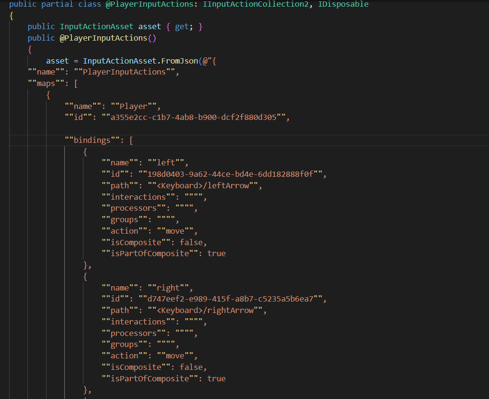
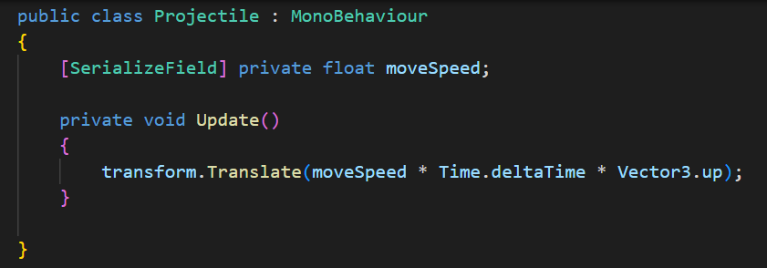

* 2.0 Player Functionality
  * 2.1: A controllable player character
    * Move() function from `PlayerController.cs` deals with managing player control mechanics. It does the following steps:
       1. Retrieves the normalized horizontal input vector from the gameInput object
       2. Creates a movement direction vector in 3D space, considering only horizontal movement
       3. Determines the minimum and maximum x positions based on the screen edges, considering the player's width and an offset
       4. Calculates a new position for the player based on the current position, input, move speed, and delta time, ensuring it stays within the screen boundaries
       5.  Updates the player's position to the calculated new position
       

  * 2.2: Moves left and right with keyboard controls
    * In PlayerInputActions(), `<Keyboard>` Left and Right refer to the specific keys on the keyboard that are mapped to the player's left and right movement, respectively. Input from these keys triggers the player object to go left or right using left or right arrow keys
      

  * 2.3: Player character fires a projectile
    * Projectile Class makes the projectile move vertically upwards at a constant speed defined by moveSpeed. It implements a projectile that falls or moves upward in the game world.
      
     * 2.31: Projectile is fired upon pressing a key

   

