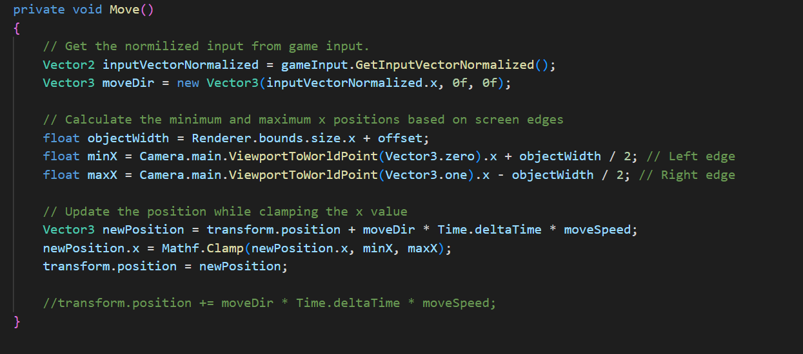

* 2.0 Player Functionality
  * 2.1: A controllable player character
    * The Move() function from `PlayerController.cs` deals with managing player control mechanics. It does the following steps:
       1. Retrieves the normalized horizontal input vector from the gameInput object
       2. Creates a movement direction vector in 3D space, considering only horizontal movement
       3. Determines the minimum and maximum x positions based on the screen edges, considering the player's width and an offset
       4. Calculates a new position for the player based on the current position, input, move speed, and delta time, ensuring it stays within the screen boundaries
       5.  Updates the player's position to the calculated new position
       

 * 2.2: Moves left and right with keyboard controls
    *
